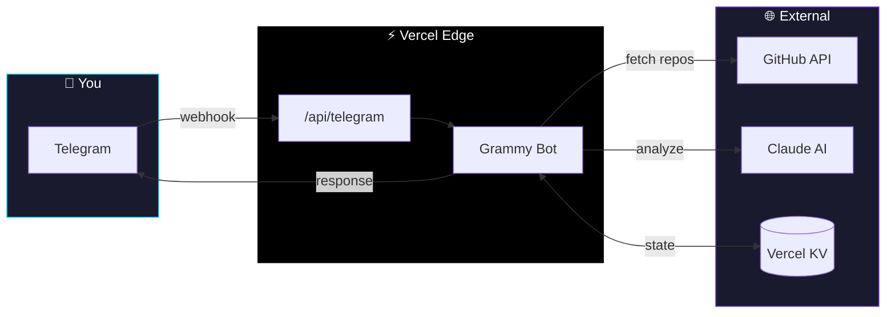

<div align="center">
  
  <p><strong>AI-powered Telegram bot that analyzes your GitHub repos and tells you whether to ship, focus, or kill each project</strong></p>
  <p>
    <a href="https://github-tndr.vercel.app"><strong>🚀 Live Demo</strong></a>
    ·
    <a href="LICENSE">MIT License</a>
  </p>
</div>

# Ship or Kill Bot 🚀☠️

**AI-powered Telegram bot that analyzes your GitHub repos and tells you whether to ship, focus, or kill each project.**

Stop letting half-finished projects rot in your GitHub. This bot scans your repositories, identifies what's actually valuable, and gives you brutally honest recommendations: ship it as-is, cut to the core feature, or kill it entirely. Get paste-ready refactoring prompts and launch-ready tweets when you're done.

## Current Status

**Working Now:**
- ✅ GitHub repo analysis with ship/cut/kill verdicts
- ✅ Chart image analysis with zone detection (bel-rtr integration)
- ✅ Cover image generation (Gemini 3 Pro)
- ✅ Push notifications for watched repos
- ✅ AI-generated Cursor prompts, copy, and launch posts
- ✅ Swipe-based card feed for daily task selection

**Up Next:** [Plugin Architecture Refactor](.cursor/plans/plugin-architecture.md)
- Restructure into isolated, modular tools
- Add new commands (`/cover`, `/screenshot`, `/readme`, `/dive`)
- Set up bidirectional sync with external repos (bel-rtr)

## What It Does

- **Scans your GitHub repos** from the last N days and analyzes each one
- **Identifies core value** by examining code structure, README, and commit patterns  
- **Gives clear verdicts**: Ship as-is, Cut to core, No core found, or Dead project
- **Generates Cursor prompts** with specific files to delete and acceptance criteria
- **Drafts launch tweets** when you mark projects as shipped
- **Tracks project states** so nothing falls through the cracks
- **Analyzes chart images** — send any chart photo to get key zones and annotations

## Commands

| Command | Description |
|---------|-------------|
| `/repo <name>` | Analyze a specific GitHub repo |
| `/scan` | Batch analyze repos from last 10 days |
| `/next` | Get your next task card |
| `/status` | See counts by state (ready, dead, shipped, etc.) |
| `/watch <name>` | Watch repo for meaningful pushes |
| `/unwatch <name>` | Stop watching a repo |
| `/watching` | List all watched repos |
| **Send photo** | Analyze chart image for key zones |

## How It Works

```
You: /scan

Bot: ⏳ Analyzing 8 repos...

Bot: [1/8] ━━━ crypto-dashboard ━━━
Three products jammed into one: portfolio tracker, news feed, social stream.
Core: The real-time portfolio chart (clean UI, live updates)
Cut: NewsFeed.tsx, SocialStream.tsx, news-api.ts, social.ts
Verdict: Cut to core
[Cut to core] [Ship as-is] [Kill]

You: [Cut to core]

Bot: Here's the Cursor prompt:
┌─────────────────────────────────────────────────┐
│ Refactor crypto-dashboard to its core           │
│                                                 │
│ Delete:                                         │
│ - components/NewsFeed.tsx                       │
│ - components/SocialStream.tsx                   │
│ - lib/news-api.ts                               │
│                                                 │
│ Acceptance: App loads with only portfolio view. │
└─────────────────────────────────────────────────┘

You: done

Bot: Ready to ship! Here's your launch tweet:
"Built a clean crypto portfolio tracker with real-time updates..."
```

## Setup

1. **Clone and install**
   ```bash
   git clone https://github.com/yourusername/github-tndr
   cd github-tndr
   npm install
   ```

2. **Environment variables**
   ```bash
   cp .env.example .env.local
   ```
   Fill in:
   - `TELEGRAM_BOT_TOKEN` - Get from [@BotFather](https://t.me/botfather)
   - `ANTHROPIC_API_KEY` - Get from [Anthropic Console](https://console.anthropic.com)
   - `GITHUB_TOKEN` - Personal access token with repo read permissions
   - `KV_*` - Vercel KV database credentials

3. **Deploy**
   ```bash
   vercel deploy
   ```

4. **Set webhook**
   ```bash
   curl -X POST "https://api.telegram.org/bot<YOUR_BOT_TOKEN>/setWebhook" \
        -H "Content-Type: application/json" \
        -d '{"url": "https://your-app.vercel.app/api/telegram"}'
   ```

## Architecture



## Tech Stack

- **Runtime**: Node.js + TypeScript
- **Bot Framework**: Grammy (Telegram Bot API)
- **AI**: Anthropic Claude (analysis, prompts) + Google Gemini (vision, image gen)
- **Database**: Vercel KV (Redis)
- **Deployment**: Vercel Edge Functions
- **GitHub API**: REST API for repo analysis

## What This Isn't

This bot won't magically make you ship more. It's a decision-making tool that cuts through analysis paralysis by providing objective analysis of your projects. You still need to do the work.

## Contributing

See [SETUP.md](SETUP.md) for detailed development setup instructions.