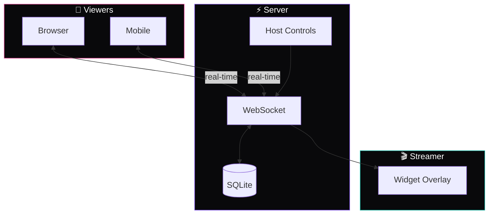
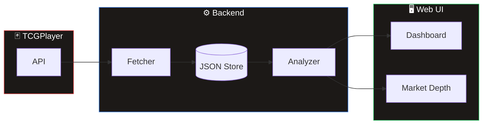

# Project Portfolio Digest

> Auto-generated compilation of 28 projects for LLM ingestion
> Generated: 2025-12-21
> Timeframe: Last 150 days

---

## Quick Index

| Project | Description | Tech Stack |
|---------|-------------|------------|
| **tweet-price** | **Do founder tweets move token prices? | React, Next.js, TypeScript, Node.js |
| **physics-vid** | make videos from physics | - |
| **arena-lib** | **Turn your visual taste into AI-readable rules. | Next.js, Vercel, Claude AI, Tailwind |
| **github-tndr** | **AI-powered Telegram bot that analyzes your GitHub repos an... | TypeScript, Node.js, Vercel, Telegram |
| **prmpt-hstry** | You use Cursor daily. | Next.js, Python, Go, Vercel |
| **cursor-habits** | **Turn your Cursor chat history into personalized rules — au... | Python, Go, Vercel |
| **rev-agg** | **Real-time leaderboard tracking crypto protocols that actua... | Next.js, TypeScript, Vercel, Tailwind |
| **bel-rtr** | > Chart analysis that's actually verifiable. | React, Next.js, Node.js, Tailwind |
| **cursortimer** | Cursor-ETA shows a live *≈ETA* timer and progress bar for lo... | Python |
| **spaces-chat** | **Real-time chat overlay for Twitter Spaces and livestreams ... | Node.js |
| **kab-query** | **Real-time Pokemon TCG market depth analysis using TCGPlaye... | Next.js, TypeScript, Node.js, Vercel |
| **chart-predictoor** | **A real-time BTC price prediction game where your rank chan... | Vercel |
| **ai-assistant-grows** | **Learn to build AI agents from scratch through hands-on les... | Python, OpenAI |
| **habit-snapper** | **Photo-proof habit tracking with AI meal analysis for real ... | React, Next.js, TypeScript, Vercel |
| **coursebuilder** | **AI-powered course generator that transforms any topic into... | React, Next.js, TypeScript, Node.js |
| **whp-app** | **Automatically generate branded completion certificates whe... | React, Next.js, Vercel, PostgreSQL |
| **anti-slop-lib** | **Detect and prevent AI-generated "slop" aesthetic in web pr... | TypeScript, Vercel, Tailwind |
| **ai-changelog** | **Turn AI model updates into scored business opportunities f... | React, Next.js, Vercel, Claude AI |
| **catalysts** | **Real-time catalyst detection system that explains why Sola... | React, Next.js, TypeScript, Solana |
| **rohunvora** | (No description) | - |
| **llm-arb** | hmmm | - |
| **gt-test** | asfs | - |
| **hl-analyzer** | (No description) | - |
| **rohun** | In the project directory, you can run: | React, Go |
| **unfllw** | (No description) | - |
| **rrcalc** | A minimal, mobile-first tool for evaluating cryptocurrency t... | Go |
| **iqmode** | (No description) | - |
| **srs-test** | (No description) | - |

---

## Full Project Details

### tweet-price

> **Do founder tweets move token prices?

- **Repo:** [rohunvora/tweet-price](https://github.com/rohunvora/tweet-price)
- **Last updated:** 2025-12-20
- **Live:** https://tweet-price-rohun-voras-projects.vercel.app/chart
- **Tech:** React, Next.js, TypeScript, Node.js, Python, Vercel, Solana, Tailwind

<details>
<summary>📄 README (click to expand)</summary>

# Tweet-Price Correlation Analyzer

**Do founder tweets move token prices?**

A multi-asset analytics platform that visualizes and analyzes the relationship between crypto project founders' tweets and their token's price action.

## Live Site

**https://tweet-price-rohun-voras-projects.vercel.app**

## Current State

### What's Built
- **Interactive chart** with TradingView-style candlesticks + tweet markers as avatar bubbles
- **Data table** sorted by price impact - instantly see which tweets moved price most
- **7 assets tracked** across 4 networks (Solana, Hyperliquid, BSC, Monad)
- **1,346 tweet events** with aligned price data
- **Multi-source price fetching** (GeckoTerminal, Birdeye, CoinGecko, Hyperliquid)
- **Static export** for fast CDN delivery via Vercel

### Assets Tracked

| Token | Founder | Network | Tweets |
|-------|---------|---------|--------|
| PUMP | [@a1lon9](https://x.com/a1lon9) | Solana | 102 |
| USELESS | [@theunipcs](https://x.com/theunipcs) | Solana | 420 |
| JUP | [@weremeow](https://x.com/weremeow) | Solana | 343 |
| ASTER | [@cz_binance](https://x.com/cz_binance) | BSC | 306 |
| LAUNCHCOIN | [@pasternak](https://x.com/pasternak) | Solana | 81 |
| MON | [@keoneHD](https://x.com/keoneHD) | Monad | 60 |
| HYPE | [@chameleon_jeff](https://x.com/chameleon_jeff) | Hyperliquid | 34 |

## Features

### Chart (`/chart`)
- **TradingView-style candlesticks** with multiple timeframes (1m, 15m, 1h, 1D)
- **Tweet markers** as founder avatar bubbles overlaid o

...(truncated)

</details>

---

### physics-vid

> make videos from physics

- **Repo:** [rohunvora/physics-vid](https://github.com/rohunvora/physics-vid)
- **Last updated:** 2025-12-20

<details>
<summary>📄 README (click to expand)</summary>

# physics-vid
make videos from physics

hi

</details>

---

### arena-lib

> **Turn your visual taste into AI-readable rules.

- **Repo:** [rohunvora/arena-lib](https://github.com/rohunvora/arena-lib)
- **Last updated:** 2025-12-20
- **Tech:** Next.js, Vercel, Claude AI, Tailwind

<details>
<summary>📄 README (click to expand)</summary>

# Arena Refs

**Turn your visual taste into AI-readable rules.**

You collect references in Are.na. This system converts them into structured guidance that makes AI coding assistants (Cursor, Claude, etc.) build interfaces that match your aesthetic.

## 🚀 Live Component Gallery

**Live**: [site-qhre0qj0j-rohun-voras-projects.vercel.app](https://site-qhre0qj0j-rohun-voras-projects.vercel.app)

Your Are.na saves → structured, replicable components → **live-rendered design system**.

### What's New: Live Rendering

Components are no longer just screenshots with metadata. They're **rendered live** using extracted design tokens:

- **Live Hero Compositions** — see each component rendered with its actual colors, typography, shadows, and spacing
- **Interactive Atom Previews** — buttons you can hover, surfaces with real gradients, typography at true scale
- **No Screenshots First** — the reference image is tucked away; you see the *implementation* first

### Features

- **26 components** extracted with AI from UI/UX channel
- **104 atoms** (buttons, surfaces, cards, typography) live-rendered and copyable
- **8 aesthetic families** (Flat Minimal, Soft Gradient, Dark Premium, etc.)
- **Copy-paste CSS** for every component and atom
- **Export** to `.cursorrules`, CSS variables, or Tailwind config
- **Dark mode** with refined typography (IBM Plex Sans/Mono)

### Quick Start: Extract Your Own Components

```bash
# Extract components from your Are.na channel
npx tsx cli/extract-component

...(truncated)

</details>

---

### github-tndr

> **AI-powered Telegram bot that analyzes your GitHub repos and tells you whether to ship, focus, or kill each project.

- **Repo:** [rohunvora/github-tndr](https://github.com/rohunvora/github-tndr)
- **Last updated:** 2025-12-20
- **Live:** https://github-tndr.vercel.app
- **Tech:** TypeScript, Node.js, Vercel, Telegram, Claude AI, Redis

<details>
<summary>📄 README (click to expand)</summary>

<p><strong>AI-powered Telegram bot that analyzes your GitHub repos and tells you whether to ship, focus, or kill each project</strong></p>
  <p>
    ·
  </p>

# Ship or Kill Bot 🚀☠️

**AI-powered Telegram bot that analyzes your GitHub repos and tells you whether to ship, focus, or kill each project.**

Stop letting half-finished projects rot in your GitHub. This bot scans your repositories, identifies what's actually valuable, and gives you brutally honest recommendations: ship it as-is, cut to the core feature, or kill it entirely.

## Commands

### 📊 Analysis
| Command | Description |
|---------|-------------|
| `/repo <name>` | Analyze a GitHub repo (ship/cut/kill verdict) |
| `/scan` | Batch analyze all repos from last N days |
| **Send photo** | Analyze chart image for support/resistance zones |

### 🎨 Generation
| Command | Description |
|---------|-------------|
| `/preview <repo>` | Generate cover image → approve → add to README |
| `/readme <repo>` | Generate/optimize README |

### 🎴 Feed
| Command | Description |
|---------|-------------|
| `/next` | Carousel of active projects — pick what to work on |
| `/status` | See repo counts by state |

## How It Works

```
You: /scan

Bot: 🔍 Scanning...
     ████████░░ 80%
     📂 crypto-dashboard
     🟢2 🟡3 🔴1 ☠️1

Bot: ✅ Scan Complete (8 repos)
     
     🟢 Ready to Ship (2)
       • github-tndr
       • bel-rtr
     
     🟡 Cut to Core (3)
       • crypto-dashboard
       • habit-tracker
       • note-app

You: 

...(truncated)

</details>

---

### prmpt-hstry

> You use Cursor daily.

- **Repo:** [rohunvora/prmpt-hstry](https://github.com/rohunvora/prmpt-hstry)
- **Last updated:** 2025-12-19
- **Live:** https://prmpt-hstry.vercel.app
- **Tech:** Next.js, Python, Go, Vercel, OpenAI

<details>
<summary>📄 README (click to expand)</summary>

<h1>cursorhabits</h1>
  <p><strong>Your chat history writes your rules.</strong></p>
  <p>Extract patterns from your Cursor conversations and generate personalized .cursorrules automatically.</p>
  
  <p>
    <a href="https://prmpt-hstry.vercel.app"><strong>🌐 Website</strong></a> ·
    <a href="#quick-start"><strong>⚡ Quick Start</strong></a> ·
  </p>

> **⚠️ Status: Unreviewed**
> 
> The new `cursorhabits/` CLI package was just built and I haven't had time to review how it actually works or test it properly. **Next step: fully try it out, rip it apart, and validate it works as expected.** Use at your own risk until this notice is removed.

## The Problem

You use Cursor daily. You've said things like this **dozens** of times:

> "Push to GitHub when you're done"  
> "Don't test locally, deploy to Vercel"  
> "Always check mobile"  
> "Add that key to .env"

But you never formalize these into rules because:
- You can't remember them all in the moment
- Writing rules from scratch feels arbitrary
- You don't know what you *actually* repeat vs. what you *think* you repeat

**Your chat history already knows.** This tool extracts it.

## Quick Start

### Option 1: pip install (recommended)

```bash
pip install cursorhabits
cursorhabits
```

### Option 2: Run from source

```bash
git clone https://github.com/rohunvora/prmpt-hstry.git
cd prmpt-hstry/cursorhabits
pip install -e .
cursorhabits
```

That's it. No API keys required, no accounts, no data uploaded anywhere.

## Output

`

...(truncated)

</details>

---

### cursor-habits

> **Turn your Cursor chat history into personalized rules — automatically.

- **Repo:** [rohunvora/cursor-habits](https://github.com/rohunvora/cursor-habits)
- **Last updated:** 2025-12-18
- **Tech:** Python, Go, Vercel

<details>
<summary>📄 README (click to expand)</summary>

# cursor-habits

**Turn your Cursor chat history into personalized rules — automatically.**

Stop repeating yourself. Let your past conversations teach Cursor how you like to work.

## The Problem

You use Cursor daily. You've said things like this *dozens* of times:

> "Push to GitHub when you're done"
> "Don't test locally, deploy to Vercel"  
> "Always check mobile"
> "Add that key to .env"

But you never formalize these into rules because:
- You can't remember them all in the moment
- Writing rules from scratch feels arbitrary
- You don't know what you *actually* repeat vs. what you *think* you repeat

**Your chat history knows.** This tool extracts it.

## How It Works

```
┌─────────────────────────────────────────────────────────────┐
│  Your 1000s of Cursor messages                              │
│  ↓                                                          │
│  cursor-habits analyzes patterns                            │
│  ↓                                                          │
│  Outputs rules you actually need                            │
└─────────────────────────────────────────────────────────────┘
```

**Everything runs locally. Your data never leaves your machine.**

# Clone the repo
git clone https://github.com/yourusername/cursor-habits.git
cd cursor-habits

# Run it
python cursor_habits.py
```

No API keys. No accounts. No data uploaded anywhere.

## Usage

### Basic: Analyze all your chats

```bash
python cursor_habits.py
```

Output:
```
📊 Found 1,

...(truncated)

</details>

---

### rev-agg

> **Real-time leaderboard tracking crypto protocols that actually buy back their tokens from the market.

- **Repo:** [rohunvora/rev-agg](https://github.com/rohunvora/rev-agg)
- **Last updated:** 2025-12-18
- **Live:** https://rev-agg.vercel.app
- **Tech:** Next.js, TypeScript, Vercel, Tailwind
- **Stars:** 7

<details>
<summary>📄 README (click to expand)</summary>

<p><strong>Real-time leaderboard tracking crypto protocols that actually buy back their tokens from the market.</strong></p>
  <p>
  </p>

# Buyback Tracker

**Real-time leaderboard tracking crypto protocols that actually buy back their tokens from the market.**

Unlike most DeFi protocols that just distribute fees to stakers, this tracks the rare protocols with verified buyback programs—where the protocol actively purchases tokens from the open market. Get P/E ratios, buyback yields, and trend data for protocols like Hyperliquid, pump.fun, Maker, and Aave that are actually reducing token supply through market purchases.

**🔗 Live App:** [rev-agg.vercel.app](https://rev-agg.vercel.app)

## What It Does

- **Curated Buyback List** — Only protocols with verified market buyback mechanisms (not fee distribution)
- **Real-time Metrics** — P/E ratios, buyback yields, 7-day trends updated every 30 seconds
- **Revenue Comparison** — See top revenue generators and which ones have buyback programs
- **Market Analysis** — Compare buyback efficiency across protocols with standardized metrics

## Key Features

### 📊 Dual Dashboard View

**Buybacks Tab**
- Verified protocols that buy tokens from open market
- P/E ratios based on buyback amounts vs market cap
- Annualized buyback yield as % of market cap
- 7-day buyback and price trend indicators

**Revenue Tab**
- Top 30 protocols by daily revenue
- 🔄 Badge indicates which have buyback programs
- Sortable by daily revenue, 7d change, 30

...(truncated)

</details>

---

### bel-rtr

> > Chart analysis that's actually verifiable.

- **Repo:** [rohunvora/bel-rtr](https://github.com/rohunvora/bel-rtr)
- **Last updated:** 2025-12-18
- **Live:** https://bel-rtr.vercel.app
- **Tech:** React, Next.js, Node.js, Tailwind

<details>
<summary>📄 README (click to expand)</summary>

# Belief Router

> Chart analysis that's actually verifiable.

Paste a chart screenshot. Get support/resistance levels backed by visual AI analysis, not guesses. Every analysis includes clear invalidation rules and decision frameworks.

This isn't ChatGPT with a system prompt—it's a specialized tool for traders who want consistency and verification.

## Features

- **Chart Analysis** — Drop a screenshot, get structured technical analysis in seconds
- **AI-Annotated Charts** — Zones automatically drawn on your chart with Gemini's image generation
- **Consistent Output** — Same structured format every time (regime, levels, scenarios, invalidation)
- **Decision Framework** — Every analysis includes entry confirmations and invalidation rules
- **Follow-up Chat** — Ask questions about the analysis with full context preserved

## How It Works

```
Upload chart → AI extracts story + levels → Zones drawn on chart → Structured output
```

The analysis always includes:
1. **Story** — What happened on this chart, told like you're explaining to a friend
2. **Regime** — Current market state (uptrend, downtrend, range, breakout, breakdown)
3. **Key Zones** — Up to 4 support/resistance levels with strength ratings
4. **Scenarios** — Bullish and bearish "if/then" conditionals
5. **Invalidation** — Clear rules for when the thesis is wrong

## Tech Stack

- **Framework**: Next.js 16 + React 19
- **Styling**: Tailwind CSS 4
- **Animation**: Framer Motion
- **AI**: Google Gemini 2.0 Flash (analy

...(truncated)

</details>

---

### cursortimer

> Cursor-ETA shows a live *≈ETA* timer and progress bar for long-running Cursor AI agent runs.

- **Repo:** [rohunvora/cursortimer](https://github.com/rohunvora/cursortimer)
- **Last updated:** 2025-12-16
- **Tech:** Python

<details>
<summary>📄 README (click to expand)</summary>

# Cursor-ETA ‑ Know When the Agent Finishes

Cursor-ETA shows a live *≈ETA* timer and progress bar for long-running Cursor AI agent runs. It adds **zero token overhead** and works both in the terminal and through an optional VS Code status-bar extension.

## Features
* Real-time ETA (seconds / minutes / hours)
* Progress bar with **current step / total steps**
* Live token counter
* JSON `STATUS|…` messages for machine consumption (used by the VS Code extension)
* Decorator `@track_agent` for one-liner integration
* Pure-Python, **no external dependencies**

## Quick Start
```bash
# 1. Install from source (PyPI publication coming later)
pip install -e cursor-eta-indicator

# 2. Use in your agent code
from cursor_eta import track_agent

@track_agent(steps=5, duration=20.0)
def my_agent():
    ...

my_agent()

# 3. Optional – show status in VS Code
a) cd cursor-eta-indicator/vscode-extension
b) npm install && npm run package
c) code --install-extension cursor-eta-*.vsix
```

Run the built-in demo:
```bash
python -m cursor_eta --demo
```

## How It Works
```mermaid
graph LR
    A[Your Agent Code] --decorated--> B[AgentWrapper.execute_with_eta]
    B --> C[AgentETATracker.start]
    C --> D[Background Update Thread]
    D --> E{{\"STATUS|{…}\" on stdout}}
    D --> F[/ETA line on stderr/]
    E -->|Parse| G[VS Code Extension]
```
* The tracker starts a background thread that emits human-readable updates to `stderr` and machine-readable JSON to `stdout`.
* The VS Code extension li

...(truncated)

</details>

---

### spaces-chat

> **Real-time chat overlay for Twitter Spaces and livestreams with OBS integration.

- **Repo:** [rohunvora/spaces-chat](https://github.com/rohunvora/spaces-chat)
- **Last updated:** 2025-12-16
- **Tech:** Node.js

<details>
<summary>📄 README (click to expand)</summary>

<p><strong>Real-time chat overlay for Twitter Spaces and livestreams with OBS integration.</strong></p>

# Spaces Chat

**Real-time chat overlay for Twitter Spaces and livestreams with OBS integration.**

Turn any livestream into an interactive experience with zero-friction chat that viewers can join instantly. Built specifically for streamers who need a lightweight, OBS-ready chat widget that works seamlessly with browser sources and chroma key effects.

## Architecture



## What it does

- **OBS-ready widget** - Drop into any streaming setup as a browser source with chroma key support
- **Zero friction chat** - Viewers start chatting immediately, no signup or login required  
- **Host controls** - Slow mode, emoji-only mode, message pinning for stream moderation
- **Mobile optimized** - Perfect for Twitter Spaces listeners chatting on their phones
- **Real-time WebSocket** - Instant message d

...(truncated)

</details>

---

### kab-query

> **Real-time Pokemon TCG market depth analysis using TCGPlayer API data.

- **Repo:** [rohunvora/kab-query](https://github.com/rohunvora/kab-query)
- **Last updated:** 2025-12-16
- **Tech:** Next.js, TypeScript, Node.js, Vercel, Tailwind

<details>
<summary>📄 README (click to expand)</summary>

<p><strong>Pokemon TCG market depth analyzer that tracks card supply and pricing data from TCGPlayer API.</strong></p>

# TCG Market Tools

**Real-time Pokemon TCG market depth analysis using TCGPlayer API data.** Track card supply, pricing trends, and market liquidity beyond just current prices. Get the supply/demand insights you need to make informed trading decisions in the Pokemon TCG market.

## What It Does

- **Market Depth Analysis** - Analyzes supply distribution and pricing depth for Pokemon cards
- **Real-time Data** - Fetches current market data from TCGPlayer API
- **Supply Estimates** - Tracks available inventory and market liquidity indicators  
- **Web Interface** - Clean Next.js dashboard for viewing market analysis
- **API Backend** - Programmatic access to market data and analysis

## Architecture



## Features

- 📊 Market depth visualization for Pokemon TCG cards
- 🔄 Au

...(truncated)

</details>

---

### chart-predictoor

> **A real-time BTC price prediction game where your rank changes live as the market moves toward or away from your guess.

- **Repo:** [rohunvora/chart-predictoor](https://github.com/rohunvora/chart-predictoor)
- **Last updated:** 2025-12-16
- **Tech:** Vercel

<details>
<summary>📄 README (click to expand)</summary>

<p><strong>Real-time BTC price prediction game with live leaderboard that updates as price moves toward/away from your guess.</strong></p>

# Chart Predictoor 📈

**A real-time BTC price prediction game where your rank changes live as the market moves toward or away from your guess.**

The magic isn't in predicting the exact price—it's watching your position climb and fall in real-time as each price tick brings you closer to victory or defeat. Make your prediction, then experience the genuine tension of live rank tracking during 60-second rounds.

**🎮 [Play Live Demo](https://chart-pred.vercel.app)**

## What It Does

- **Live price predictions** — Guess where BTC will be when the 60-second round ends
- **Real-time rank updates** — Watch your leaderboard position change as price moves
- **Visual feedback** — See your prediction line on the TradingView chart
- **Instant competition** — Jump in and play immediately, no signup required
- **Mobile responsive** — Works seamlessly on desktop and mobile

## How It Works

```mermaid
flowchart LR
    subgraph Game["🎮 Game Loop"]
        Join[Join Round]
        Predict[Make Prediction]
        Watch[Watch Live]
        Result[See Winner]
    end
    
    subgraph Data["📈 Live Data"]
        WS[Binance WebSocket]
        Chart[TradingView Chart]
        Rank[Live Leaderboard]
    end
    
    Join --> Predict
    Predict --> Watch
    Watch --> Result
    Result --> Join
    
    WS --> Chart
    WS --> Rank
    Chart --> Watch
    

...(truncated)

</details>

---

### ai-assistant-grows

> **Learn to build AI agents from scratch through hands-on lessons with working code.

- **Repo:** [rohunvora/ai-assistant-grows](https://github.com/rohunvora/ai-assistant-grows)
- **Last updated:** 2025-12-16
- **Tech:** Python, OpenAI

<details>
<summary>📄 README (click to expand)</summary>

<p><strong>A structured learning journey to build AI agents from scratch, with hands-on lessons and working code examples.</strong></p>

# 🤖 AI Assistant That Grows - Learning Journey

**Learn to build AI agents from scratch through hands-on lessons with working code.** This structured curriculum takes you from basic API calls to sophisticated agents with memory, tools, and state management - no confusion, no getting stuck in loops, just clear progression with real examples you can run immediately.

## What This Is

A progressive learning path that demystifies AI agent development. Each lesson builds on the previous one with:
- **Working Python code** you can run right now
- **Clear explanations** of what's actually happening under the hood
- **Real insights** about costs, limitations, and practical considerations
- **No magic** - just understanding how the pieces fit together

Perfect for developers who want to understand AI agents beyond surface-level tutorials.

## 📚 Current Progress

### ✅ Lesson 1: API Basics (COMPLETE)
**What you'll learn:**
- AI APIs are just text in → text out (no magic!)
- API key setup and authentication
- Model selection and cost implications (gpt-4o-mini vs gpt-4o = 33x cost difference)
- Token counting and real-world pricing

**Key files:** `exercise1_basic_call.py`, `model_comparison.py`, `interactive_chat.py`

### ✅ Lesson 2: Memory Fundamentals (COMPLETE)  
**What you'll learn:**
- AI has ZERO memory - forgets everything instantly
- How to i

...(truncated)

</details>

---

### habit-snapper

> **Photo-proof habit tracking with AI meal analysis for real accountability**

- **Repo:** [rohunvora/habit-snapper](https://github.com/rohunvora/habit-snapper)
- **Last updated:** 2025-12-16
- **Live:** https://habit-breaker-three.vercel.app
- **Tech:** React, Next.js, TypeScript, Vercel, PostgreSQL, Tailwind, Supabase

<details>
<summary>📄 README (click to expand)</summary>

<p><strong>Habit tracker with photo proof verification and AI meal analysis for accountability.</strong></p>
  <p>
  </p>

# Habit Snapper

**Photo-proof habit tracking with AI meal analysis for real accountability**

Stop lying to yourself about your habits. Habit Snapper requires photo evidence to verify habit completion - you can't just check a box, you have to actually do the thing and prove it. Built-in AI analyzes your meal photos for nutritional content, turning your food logs into actionable insights.

## What It Does

- **Photo-Required Verification**: Submit photo proof for every habit completion - workouts, meals, meditation, anything
- **AI Meal Analysis**: Automatically analyze meal photos for calories, macros, and nutritional content
- **Visual Progress Tracking**: See your consistency through heatmaps and calendar views
- **Accountability Through Evidence**: Can't fake it - the camera doesn't lie
- **Habit History**: Review your proof photos and track long-term patterns

## Why Photo Proof Works

Traditional habit trackers rely on the honor system. Habit Snapper eliminates self-deception by requiring visual evidence. When you know you'll need to take a photo, you're more likely to actually complete the habit - and complete it properly.

## Architecture

```mermaid
flowchart LR
    subgraph User["👤 User"]
        Habit[Complete Habit]
        Photo[📸 Take Photo]
    end
    
    subgraph App["📱 App"]
        Upload[Upload]
        AI[AI Analysis]
        DB[(

...(truncated)

</details>

---

### coursebuilder

> **AI-powered course generator that transforms any topic into gamified, Duolingo-style micro-learning with spaced repetition and learning science.

- **Repo:** [rohunvora/coursebuilder](https://github.com/rohunvora/coursebuilder)
- **Last updated:** 2025-12-16
- **Live:** https://courseai-beta.vercel.app
- **Tech:** React, Next.js, TypeScript, Node.js, Vercel, OpenAI, PostgreSQL, Tailwind, Prisma, Supabase
- **Stars:** 1

<details>
<summary>📄 README (click to expand)</summary>

<p><strong>AI-powered course builder that transforms any topic into gamified, Duolingo-style micro-learning with spaced repetition.</strong></p>
  <p>
  </p>

# Course Builder

**AI-powered course generator that transforms any topic into gamified, Duolingo-style micro-learning with spaced repetition and learning science.**

Turn "Machine Learning" or "Spanish Cooking" into a complete learning course in minutes. Our AI pipeline automatically generates structured flashcards, quizzes, and skill progressions, then uses Bayesian knowledge tracking and spaced repetition to optimize your retention. No manual course creation required.

## What It Does

- **🤖 AI Course Generation**: Input any topic → Get a complete course with cards, quizzes, and skill trees
- **🧠 Learning Science**: Bayesian knowledge tracking, spaced repetition (SuperMemo 2), and forgetting curve modeling
- **🎮 Gamification**: XP system, achievements, daily streaks, and mastery levels (Novice → Expert)
- **📊 Analytics Dashboard**: Track progress, skill mastery probability, and learning patterns
- **🔄 Smart Review Mode**: AI prioritizes content you're about to forget across all courses

## Quick Start

## How It Works

```mermaid
flowchart TB
    subgraph Input["💡 Input"]
        Topic["Any Topic"]
    end
    
    subgraph Gen["🤖 AI Generation"]
        GPT[GPT-4]
        Skills[Skill Tree]
        Cards[Flashcards]
    end
    
    subgraph Learn["🧠 Learning Loop"]
        Quiz[Quiz]
        BKT[Bayesian Tr

...(truncated)

</details>

---

### whp-app

> **Automatically generate branded completion certificates when students finish your Whop courses.

- **Repo:** [rohunvora/whp-app](https://github.com/rohunvora/whp-app)
- **Last updated:** 2025-12-16
- **Tech:** React, Next.js, Vercel, PostgreSQL, Tailwind, Prisma, Supabase

<details>
<summary>📄 README (click to expand)</summary>

<p><strong>Auto-generates branded completion certificates for Whop course creators when students finish lessons.</strong></p>

# Certified — Auto-issue Certificates for Whop Courses

**Automatically generate branded completion certificates when students finish your Whop courses.** Solves the #1 requested feature in Courses app reviews with zero manual work — just connect your webhook and certificates appear instantly when lessons are completed.

🔗 **Live Demo:** https://whp-app.vercel.app/

## What It Does

- **Webhook Automation** — Listens to Whop course completion events and triggers certificate generation
- **Template Management** — Create branded certificate designs through a visual editor
- **Student Experience** — Auto-generated gallery where students view and download their certificates
- **Public Verification** — Shareable URLs to verify certificate authenticity
- **Course Control** — Toggle certificate generation per course, backfill for existing completions

## Why Use This

Course creators consistently request automated certificates, but building the webhook → PDF pipeline is complex. This handles the entire flow: webhook processing, template rendering, PDF generation, student delivery, and verification — all automatically.

## Architecture

```mermaid
flowchart LR
    subgraph Whop["🎓 Whop"]
        Course[Course Completed]
    end
    
    subgraph App["⚡ Certified App"]
        WH[Webhook Handler]
        Gen[PDF Generator]
        DB[(PostgreSQL)]
    end
  

...(truncated)

</details>

---

### anti-slop-lib

> **Detect and prevent AI-generated "slop" aesthetic in web projects.

- **Repo:** [rohunvora/anti-slop-lib](https://github.com/rohunvora/anti-slop-lib)
- **Last updated:** 2025-12-16
- **Live:** https://demo-website-one-puce.vercel.app
- **Tech:** TypeScript, Vercel, Tailwind

<details>
<summary>📄 README (click to expand)</summary>

<p><strong>CLI tool that detects generic AI-generated design patterns (purple gradients, Inter font, etc.) in web projects.</strong></p>
  <p>
  </p>

# 🚫 Anti-Slop

**Detect and prevent AI-generated "slop" aesthetic in web projects.** Scan your HTML/CSS for purple gradients, Inter font, glassmorphism, and other generic AI design patterns. Get a slop score and actionable alternatives to build more distinctive interfaces.

## What This Does

Anti-Slop analyzes your web projects to identify homogenized AI-generated design patterns that make websites look identical. It provides:

- **Pattern Detection** - Scans HTML/CSS for 20+ common "slop" indicators
- **Slop Score** - Rates your project from A-F based on generic pattern usage
- **Design Alternatives** - Suggests specific fonts, colors, and layouts to break the mold
- **AI Prompt Templates** - Pre-written prompts to guide AI tools toward better aesthetics

## Common Slop Patterns Detected

- 🟣 **Purple/indigo gradients** (the #1 offender)
- 📝 **Inter or Space Grotesk fonts** (overused defaults)
- 🔮 **3D blobs and floating orbs** as decoration
- 🪟 **Glassmorphism** (backdrop-blur everywhere)
- 📐 **Centered layouts** with excessive whitespace
- 🎴 **rounded-xl cards with shadow-md**
- 💬 **Generic copy** ("Transform your X", "AI-Powered Y")

## Usage

### CLI Scanner

```bash
# Scan your entire project
npx anti-slop scan ./src

# Quick check a single file
npx anti-slop check index.html

# Get design alternatives
npx anti-s

...(truncated)

</details>

---

### ai-changelog

> **Turn AI model updates into scored business opportunities for indie hackers.

- **Repo:** [rohunvora/ai-changelog](https://github.com/rohunvora/ai-changelog)
- **Last updated:** 2025-12-16
- **Live:** https://ai-changelog-two.vercel.app
- **Tech:** React, Next.js, Vercel, Claude AI, OpenAI, Tailwind

<details>
<summary>📄 README (click to expand)</summary>

<p><strong>Turns AI model updates into scored business opportunities for indie hackers.</strong></p>
  <p>
  </p>

# AI Opportunities Hub

**Turn AI model updates into scored business opportunities for indie hackers.**

Stop missing the wave. Every AI capability release creates new business opportunities that didn't exist yesterday. This tool automatically converts AI updates from major providers into actionable, scored business ideas with MVP specs and market analysis. It's like having a research team that spots what you can build today that wasn't possible last week.

🔗 **Live Site:** [ai-changelog-two.vercel.app](https://ai-changelog-two.vercel.app)

## What This Does

- **📰 Aggregates AI Updates** — Real-time feed from OpenAI, Anthropic, Google, xAI, Perplexity
- **🔓 Identifies Capability Unlocks** — Filters for updates that enable NEW things (not just improvements)
- **🎯 Generates Business Opportunities** — AI-powered analysis creates scored business ideas with:
  - Indie Viability Score (1-5): Can a solo dev build this?
  - Time to Revenue Score (1-5): How fast to first $?
  - Market Opportunity Score (1-5): Competition level
  - 10-point MVP specifications
  - Risk analysis and distribution strategies
- **🏆 Vibecoded Leaderboard** — Real products built with AI tools + verified MRR
- **💾 Research Collections** — Save and organize opportunities you want to explore

## Key Features

### AI Changelog Feed (`/`)
Browse updates filtered by capability type:
- 🎤 Voice •

...(truncated)

</details>

---

### catalysts

> **Real-time catalyst detection system that explains why Solana tokens are pumping or dumping with structured event cards.

- **Repo:** [rohunvora/catalysts](https://github.com/rohunvora/catalysts)
- **Last updated:** 2025-12-16
- **Tech:** React, Next.js, TypeScript, Solana, Tailwind

<details>
<summary>📄 README (click to expand)</summary>

<p><strong>Real-time catalyst detection system that explains why Solana tokens are pumping/dumping with structured event cards.</strong></p>

# Catalysts

**Real-time catalyst detection system that explains why Solana tokens are pumping or dumping with structured event cards.**

Catalysts transforms chaotic crypto market movements into structured insights. Instead of just showing price charts, it generates "catalyst cards" - AI-powered explanations of token price movements linked to on-chain events, whale activity, and social signals. Each catalyst includes severity ratings, time horizons, evidence links, and directional bias to help you understand *why* tokens move, not just *that* they moved.

**⚠️ Status: Learning project (abandoned) - code available for reference**

## What It Does

- **Real-time monitoring** of Solana tokens for significant price movements
- **Catalyst card generation** - structured explanations of why tokens pump/dump
- **Multi-source correlation** - links on-chain events, social activity, and market data
- **AI-powered narratives** using Grok/xAI to explain complex market events
- **Severity classification** - HIGH/MEDIUM/LOW impact with time horizon predictions

## Catalyst Card Format

Each catalyst follows a structured data model:

```typescript
{
  token: "PEPE",
  type: "whale_movement",
  severity: "HIGH",
  timeHorizon: "SHORT_TERM",
  direction: "BEARISH",
  narrative: "Large holder transferred 2.5M tokens to Binance...",
  evidence: [
    { ty

...(truncated)

</details>

---

### rohunvora

> (No description)

- **Repo:** [rohunvora/rohunvora](https://github.com/rohunvora/rohunvora)
- **Last updated:** 2025-12-16

<details>
<summary>📄 README (click to expand)</summary>

skillmaxxing

</details>

---

### llm-arb

> hmmm

- **Repo:** [rohunvora/llm-arb](https://github.com/rohunvora/llm-arb)
- **Last updated:** 2025-12-15

*(No README)*

---

### gt-test

> asfs

- **Repo:** [rohunvora/gt-test](https://github.com/rohunvora/gt-test)
- **Last updated:** 2025-12-14

*(No README)*

---

### hl-analyzer

> (No description)

- **Repo:** [rohunvora/hl-analyzer](https://github.com/rohunvora/hl-analyzer)
- **Last updated:** 2025-11-29

*(No README)*

---

### rohun

> In the project directory, you can run:

- **Repo:** [rohunvora/rohun](https://github.com/rohunvora/rohun)
- **Last updated:** 2025-11-27
- **Tech:** React, Go
- **Stars:** 1

<details>
<summary>📄 README (click to expand)</summary>

This project was bootstrapped with [Create React App](https://github.com/facebook/create-react-app).

## Available Scripts

In the project directory, you can run:

### `npm start`

Runs the app in the development mode.<br />
Open [http://localhost:3000](http://localhost:3000) to view it in the browser.

The page will reload if you make edits.<br />
You will also see any lint errors in the console.

### `npm test`

Launches the test runner in the interactive watch mode.<br />
See the section about [running tests](https://facebook.github.io/create-react-app/docs/running-tests) for more information.

### `npm run build`

Builds the app for production to the `build` folder.<br />
It correctly bundles React in production mode and optimizes the build for the best performance.

The build is minified and the filenames include the hashes.<br />
Your app is ready to be deployed!

See the section about [deployment](https://facebook.github.io/create-react-app/docs/deployment) for more information.

### `npm run eject`

**Note: this is a one-way operation. Once you `eject`, you can’t go back!**

If you aren’t satisfied with the build tool and configuration choices, you can `eject` at any time. This command will remove the single build dependency from your project.

Instead, it will copy all the configuration files and the transitive dependencies (webpack, Babel, ESLint, etc) right into your project so you have full control over them. All of the commands except `eject` will still work, but

...(truncated)

</details>

---

### unfllw

> (No description)

- **Repo:** [rohunvora/unfllw](https://github.com/rohunvora/unfllw)
- **Last updated:** 2025-09-09

*(No README)*

---

### rrcalc

> A minimal, mobile-first tool for evaluating cryptocurrency trades through expected value and risk/reward calculations.

- **Repo:** [rohunvora/rrcalc](https://github.com/rohunvora/rrcalc)
- **Last updated:** 2025-09-09
- **Tech:** Go

<details>
<summary>📄 README (click to expand)</summary>

# EV Check - Expected Value Calculator

A minimal, mobile-first tool for evaluating cryptocurrency trades through expected value and risk/reward calculations.

## Features

- **5-second decisions** - Single screen, instant calculations
- **Smart inputs** - Accept market caps as "2M", "500k", etc
- **Dual requirements** - Must pass both EV > 0 and R ≥ 2 tests
- **Mobile optimized** - Designed for trading on the go
- **Confidence calibration** - Tracks your prediction accuracy over time

## Files

### 🚀 Production Versions
- `ev_apple.html` - Apple-inspired design with light theme
- `ev_ive.html` - Original Jony Ive dark theme
- `ev_custom.html` - Custom purple/dark theme variant

### 📚 Documentation
- `ev_apple_documented.html` - Fully commented version for development
- `MAINTENANCE_GUIDE.md` - Complete guide for safe editing
- `ZONES.md` - Component structure and zone breakdown

### 📦 Legacy
- `ev.html` - Alternative simpler version
- `starter.html` - Original complex version with ladder strategy

## Usage

Simply open any of the calculator versions in a modern browser. No installation required.

- **Light theme**: `ev_apple.html` 
- **Dark theme**: `ev_ive.html`
- **Purple theme**: `ev_custom.html`

### Quick Start

1. Enter entry market cap (e.g., "2M")
2. Enter target market cap (e.g., "10M") or use multiplier chips
3. Enter position size in USD (e.g., "2.5k")
4. Set max loss % you're willing to accept
5. Adjust confidence slider
6. Get instant verdict: Allowed, Border

...(truncated)

</details>

---

### iqmode

> (No description)

- **Repo:** [rohunvora/iqmode](https://github.com/rohunvora/iqmode)
- **Last updated:** 2025-08-23

*(No README)*

---

### srs-test

> (No description)

- **Repo:** [rohunvora/srs-test](https://github.com/rohunvora/srs-test)
- **Last updated:** 2025-08-06

<details>
<summary>📄 README (click to expand)</summary>

# srs-test
test

</details>

---
